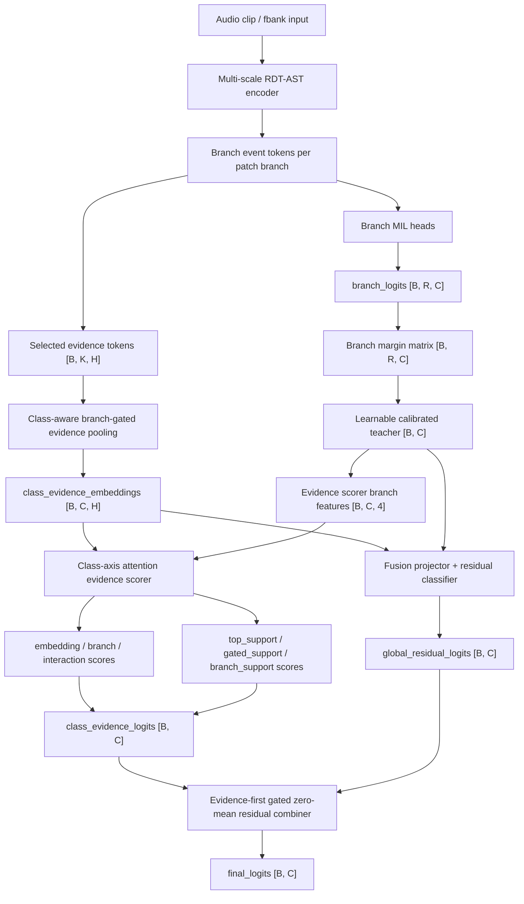

# Current Model Structure Reference

기준 실험: `CNUH_DISEASE_VER23`

이 문서는 현재 disease 3-class 모델을 layer/path/loss/diagnostics 단위로 해부한 기준 문서다. 목적은 다음 실험에서 병목을 "어느 tensor에서 발생했는지" 빠르게 추적하는 것이다. 이 문서는 version history가 아니라 현재 구조 reference이며, 새 구조가 들어오면 같은 파일에 누적 갱신한다.

## 1. 전체 신호 흐름



핵심 판단 chain은 다음 순서로 본다.

```text
branch_margin_matrix
-> class_calibrated_top_teacher_gap
-> top_support_score_gap
-> branch_direct_score_gap
-> branch_support_score_gap
-> class_evidence_total_gap
-> final_gap
```

`VER23` 기준으로는 final combiner가 주 병목이 아니다. 이전 VER22 병목은 raw `class_top_branch_margin_features` 단계에서 hard negative top이 true top을 압도하는 것이었고, VER23은 이 raw teacher를 primary path에서 제거한 뒤 learnable calibrated teacher를 source of truth로 사용한다.

## 2. Shape 표기 규칙

| 기호 | 의미 | VER23 기준 |
|---|---|---|
| `B` | batch size | train config `batch_size=4` |
| `C` | class count | `3`: `Normal`, `Lung_Parenchymal`, `Airway` |
| `R` | branch count | `4`: patch branch 4개 |
| `H` | encoder hidden size | `512` |
| `K` | selected evidence token count | runtime dependent, 대체로 `R * top_tokens_per_branch` 이하 |
| `T_r` | branch별 token count | patch size/stride와 clip length에 따라 runtime dependent |
| `D_embed` | evidence scorer embedding tower hidden | `768` |
| `D_branch` | branch feature tower hidden | `128` |
| `D_fusion` | class-axis token hidden | `1024` |

입력 feature 길이와 token 수는 spectrogram 길이, patch branch 설정, RDT selection에 따라 달라진다. 따라서 문서에서는 고정 가능한 class/branch/hidden 축은 숫자로 쓰고, token 축은 symbolic shape로 쓴다.

## 3. Config Snapshot

| 항목 | 값 |
|---|---|
| config | `configs/training_CNUH_disease_3classes.json` |
| experiment | `CNUH_DISEASE_VER23` |
| labels | `Normal=0`, `Lung_Parenchymal=1`, `Airway=2` |
| audio | 16 kHz, 30 s clip |
| fbank | 128 mel bins, max length 1024 |
| encoder hidden | `hidden_size=512` |
| shared/adaptor depth | `shared_stem_depth=1`, `adapter_depth=8` |
| patch branches | `(16,16)/(8,16)`, `(8,32)/(4,32)`, `(4,64)/(2,64)`, `(2,128)/(1,128)` |
| evidence pooling | `class_aware_branch_gated` |
| evidence scorer | `class_axis_attention`, 2 layers, 4 heads |
| teacher calibration | enabled, class-axis attention, hidden 256, 1 layer, 4 heads |
| score decomposition | enabled |
| branch feature transform | `tanh(feature / 1.0)` |
| residual combiner | bounded, zero-mean, confidence-aware gated correction |
| class weighting | `power_inverse_frequency(power=0.75)`, mean-one normalized |

주요 scorer config:

| 항목 | 값 |
|---|---|
| embedding hidden | `768` |
| branch hidden | `128` |
| fusion hidden | `1024` |
| attention layers | `2` |
| attention heads | `4` |
| dropout | `0.05` |
| class embedding | enabled |
| logit centering | enabled |
| embedding score bound | `8.0 * tanh(raw / 1.0)` |
| interaction score bound | `6.0 * tanh(raw / 1.0)` |
| branch scale | bounded sigmoid, min/init/max `0.7/1.0/2.0` |
| interaction scale | bounded sigmoid, min/init/max `0.3/0.7/1.5` |
| interaction schedule | epoch 11-30, multiplier `0.2 -> 1.0` |

## 4. 입력 및 Encoder / Backbone

| 항목 | 내용 |
|---|---|
| Module / Path | `MultiScaleRdtAstModel.forward()` 및 multi-scale encoder |
| Input | fbank tensor, shape는 data pipeline에 의해 AST/RDT encoder 입력으로 변환 |
| Output | branch event tokens tuple, context/evidence tokens |
| Purpose | 서로 다른 time-frequency patch branch가 호흡음 event를 다른 resolution에서 보도록 한다 |
| Related losses | branch/top/gate/evidence/final loss가 downstream에서 간접적으로 encoder를 학습 |
| Related diagnostics | `branch_attention_weights`, selected evidence 계열, branch/evidence score chain |
| VER22 병목 관련성 | capacity 자체보다 teacher-front objective가 병목으로 보인다 |

VER22의 branch 수는 patch branch 4개이므로 `R=4`다. 각 branch는 branch-specific token stream을 만들고, 이후 branch MIL head와 selected evidence path에 동시에 사용된다.

## 5. Branch Logits 및 Top Teacher Feature

| 항목 | 내용 |
|---|---|
| Module / Path | branch MIL heads, `branch_logits` |
| Input | branch event tokens per branch |
| Output | `branch_logits [B, R, C]` |
| Purpose | 각 branch가 class별 evidence를 독립적으로 평가한다 |
| Related losses | `top_branch_margin`, `gate_weighted_branch_margin`, `gate_branch_regret`, `gate_bad_branch_suppression`, `gate_best_branch_alignment` |
| Related diagnostics | `top_branch_margin_value`, `class_top_branch_relative_gap`, `gate_*`, `hard_negative_top_teacher_*` |
| VER22 병목 관련성 | Airway hard FN에서 true top은 약하게 양수지만 hard negative top이 훨씬 커지는 것이 핵심 병목 |

Branch teacher에서 가장 중요한 값은 class-wise top branch margin이다.

```text
branch_margin[b, r, c] =
  branch_logits[b, r, c] - max_{j != c}(branch_logits[b, r, j])

class_top_branch_margin_features[b, c] =
  max_r branch_margin[b, r, c]

class_top_branch_margin_relative_features[b, c] =
  class_top_branch_margin_features[b, c]
  - max_{j != c}(class_top_branch_margin_features[b, j])
```

true-label 기준 diagnostic gap:

```text
class_top_branch_relative_gap =
  class_top_branch_margin_features[y]
  - max_{j != y}(class_top_branch_margin_features[j])
```

VER23에서는 이 raw top teacher가 primary teacher가 아니다. Raw 값은 `branch_margin_matrix` summary와 legacy diagnostics로 남고, 실제 top-support/evidence branch feature에는 다음 calibrated teacher가 들어간다.

## 5.1 Learnable Calibrated Teacher

| 항목 | 내용 |
|---|---|
| Module / Path | `teacher_calibration`, class-axis attention module |
| Input | `branch_margin_matrix [B, R, C]`, `class_gate_weights [B, C, R]` |
| Summary | `class_teacher_calibration_summary_features [B, C, 6]` |
| Output | `class_calibrated_top_teacher_features [B, C]` |
| Relative output | `class_calibrated_top_teacher_relative_features [B, C]` |
| Purpose | raw `max_r` teacher를 learnable class-relative teacher로 교체한다 |
| Related loss | `calibrated_teacher_margin` |
| Related diagnostics | `class_calibrated_top_teacher_gap`, `class_teacher_calibration_summary_features` |

Summary feature는 label별 token 형태로 만든다.

```text
branch_margin_matrix[b, r, c] =
  branch_logits[b, r, c] - max_{j != c}(branch_logits[b, r, j])

top_margin[c] = max_r branch_margin_matrix[r, c]
mean_margin[c] = mean_r branch_margin_matrix[r, c]
gated_margin[c] = sum_r class_gate_weight[c, r] * branch_margin_matrix[r, c]
spread[c] = top_margin[c] - mean_margin[c]
hard_negative_margin[c] = max(top_margin[j != c])
raw_relative_gap[c] = top_margin[c] - hard_negative_margin[c]

teacher_summary_features[c] = [
  top_margin, mean_margin, gated_margin, spread,
  hard_negative_margin, raw_relative_gap
]
```

Calibration module:

```text
LayerNorm(6)
-> Linear(6, 256)
-> GELU
-> Dropout(0.05)
-> + class embedding
-> TransformerEncoder over class axis, 1 layer, 4 heads
-> LayerNorm
-> Linear(256, 1)
-> optional row-mean centering
```

`class_calibrated_top_teacher_relative_features[c]`는 calibrated teacher에서 `score[c] - max(score[j != c])`로 계산한다. VER23의 primary 판단은 `class_top_branch_relative_gap`이 아니라 `class_calibrated_top_teacher_gap`이다.

`VER22`의 Airway FN에서는 `top_branch_margin_value`가 약하게 양수인데도 `class_top_branch_relative_gap`이 크게 음수다. 이는 모델이 Airway branch signal을 아예 못 보는 것이 아니라, class-relative teacher 단계에서 Normal/Lung hard negative top이 true Airway top을 압도한다는 뜻이다.

## 6. Class-aware Gate 및 Evidence Pooling

| 항목 | 내용 |
|---|---|
| Module / Path | `ClassAwareBranchGatedEvidencePooling.forward()` |
| Input | `evidence_tokens [B, K, H]`, `branch_ids [B, K]` |
| Intermediate | `branch_evidence_summary [B, R, H]` |
| Gate output | `class_gate_weights [B, C, R]` |
| Output | `class_evidence_embeddings [B, C, H]` |
| Purpose | class마다 다른 branch 조합을 선택해 class-specific evidence embedding을 만든다 |
| Related losses | `gate_entropy_regularization`, `class_gate_diversity_regularization`, `gate_branch_regret`, `gate_bad_branch_suppression`, `gate_best_branch_alignment` |
| Related diagnostics | `class_evidence_gate_weights`, `class_evidence_gate_entropy`, `gate_bad_branch_mass`, `gate_best_branch_alignment_*` |
| VER22 병목 관련성 | gate 자체는 주 병목이 아니다. Airway FN은 gate보다 teacher-relative/top-support path에서 더 크게 무너진다 |

Gate 계산:

```text
branch_keys = Linear(branch_evidence_summary)
gate_logits[b, c, r] = dot(branch_keys[b, r], class_query[c]) / sqrt(D)
learned_class_gate_weights = softmax(gate_logits / temperature, dim=r)
```

Gate mixing:

```text
class_gate_weights =
  alpha * uniform_gate + (1 - alpha) * learned_class_gate_weights
```

VER22 config는 `uniform_to_learned` gate mixing을 사용한다.

```text
hold_epochs = 10
decay_epochs = 20
start_alpha = 1.0
end_alpha = 0.0
```

Class evidence embedding:

```text
class_evidence_embeddings[b, c, :] =
  sum_r class_gate_weights[b, c, r] * branch_evidence_summary[b, r, :]
```

Shape는 `[B, C, H]`, VER23 기준 `[B, 3, 512]`다.

## 7. Evidence Scorer Branch Features

| 항목 | 내용 |
|---|---|
| Module / Path | `_class_evidence_scorer_branch_raw_features()`, `_class_evidence_scorer_branch_features()` |
| Input | gated branch features, top branch margin features |
| Raw output | `class_evidence_scorer_branch_raw_features [B, C, 4]` |
| Transformed output | `class_evidence_scorer_branch_features [B, C, 4]` |
| Purpose | branch teacher signal을 evidence scorer의 branch tower와 support path에 제공한다 |
| Related losses | teacher-front, top-support, branch-direct/support, b2e loss |
| Related diagnostics | `class_gated_branch_logit_features`, `class_top_branch_margin_features`, `class_*_relative_features` |
| VER22 병목 관련성 | raw top feature가 약하거나 class-relative negative가 크면 support chain 전체가 무너진다 |

Class-axis attention scorer에서 사용하는 4개 raw feature:

```text
gated_raw[c] = class_gated_branch_logit_features[c]
gated_relative[c] = gated_raw[c] - max_{j != c}(gated_raw[j])

calibrated_top[c] = class_calibrated_top_teacher_features[c]
calibrated_relative[c] = calibrated_top[c] - max_{j != c}(calibrated_top[j])

raw_features[c] = [
  gated_raw[c],
  gated_relative[c],
  calibrated_top[c],
  calibrated_relative[c]
]
```

Legacy raw top fields `class_top_branch_margin_features` and `class_top_branch_margin_relative_features` can still be inspected when needed, but they are not the primary top-support input in VER23.

Transformed feature:

```text
branch_features = tanh(raw_features / temperature)
temperature = 1.0
```

주의: `top_support_direct_path`는 direct top score 계산에 raw features를 사용한다. branch feature tower는 transformed features를 사용한다.

## 8. Top Support / Gated Support / Branch Support Path

### 8.1 Top Support Direct Path

| 항목 | 내용 |
|---|---|
| Module / Path | `_branch_direct_score_components()` |
| Input | raw branch features `[B, C, 4]` |
| Output | `class_evidence_top_support_scores [B, C]` |
| Purpose | gate와 독립적인 top teacher 기반 support score를 만든다 |
| Related losses | `top_support_score_margin`, `top_support_gap_min_constraint` |
| Related diagnostics | `class_evidence_top_support_score_gap`, `direct_top_score_gap`, `top_support_residual_gap` |
| VER22 병목 관련성 | Airway FN에서 top support gap이 크게 음수로 전파된다 |

VER22는 `top_support_direct_path.enabled=true`이고 `mode=monotonic_raw_relative`다.

```text
raw_positive_component[c] =
  raw_scale[c] * top_raw[c]

relative_positive_component[c] =
  relative_positive_scale[c] * softplus(top_relative[c])

relative_negative_uncapped[c] =
  relative_negative_scale[c] * softplus(-top_relative[c])
```

Negative relative cap:

```text
cap_value[c] =
  max_negative_fraction[c] * relu(raw_positive_component[c])
  + negative_cap[c]

relative_negative_component[c] =
  min(relative_negative_uncapped[c], cap_value[c])
```

VER22 cap setting:

| label | max negative fraction | negative cap |
|---|---:|---:|
| default | 0.75 | 1.5 |
| Airway | 0.5 | 1.0 |

Direct top score:

```text
direct_top_score[c] =
  raw_positive_component[c]
  + relative_positive_component[c]
  - relative_negative_component[c]
  + class_bias[c]
```

Top support residual:

```text
top_support_residual_score[c] =
  residual_bound * tanh(residual_mlp(branch_features[c]) / residual_temperature)

top_support_score[c] =
  direct_top_score[c]
  + top_support_direct_residual_scale * top_support_residual_score[c]
```

`logit_centering=true`이므로 class-axis score component는 class axis 평균 제거를 거친다.

### 8.2 Gated Support 및 Gate Reliability

| 항목 | 내용 |
|---|---|
| Module / Path | `_branch_direct_score_components()` |
| Input | transformed gated features `[B, C, 2]` |
| Output | `class_evidence_gated_support_scores [B, C]`, `class_evidence_gate_reliability [B, C]` |
| Purpose | gate가 선택한 branch signal을 support score에 반영하되, top-vs-gated regret이 크면 attenuate한다 |
| Related losses | `gate_branch_regret`, `gate_bad_branch_suppression`, `gate_best_branch_alignment` |
| Related diagnostics | `class_evidence_gate_reliability`, `class_evidence_gate_reliability_regret`, `class_evidence_gated_support_score_gap` |
| VER22 병목 관련성 | gate path는 보조 병목일 수 있지만, Airway FN의 주 병목은 top teacher relative gap이다 |

Reliability:

```text
top_margin[c] = top raw margin family
gated_margin[c] = gated raw margin family

gate_regret[c] = relu(top_margin[c] - gated_margin[c] - tolerance)
gate_reliability[c] = exp(-gate_regret[c] / temperature)
```

VER22는 `detach=true`라서 reliability 조건 자체는 gate/branch margin으로 gradient를 우회 전파하지 않는다.

### 8.3 Branch Direct 및 Branch Support

| 항목 | 내용 |
|---|---|
| Module / Path | `_branch_direct_score_components()` |
| Input | top support, gated support, gate reliability, branch feature residual |
| Output | `class_evidence_branch_direct_scores [B, C]`, `class_evidence_branch_support_scores [B, C]` |
| Purpose | branch teacher signal을 class evidence logit에 들어갈 branch support score로 변환한다 |
| Related losses | `branch_direct_score_margin`, `branch_support_score_margin`, `branch_path_dominance_constraint`, `branch_support_disagreement_cap_regularization` |
| Related diagnostics | `branch_direct_score_gap`, `branch_support_score_gap`, `class_evidence_branch_scale` |
| VER22 병목 관련성 | top support가 음수로 무너지면 branch direct/support도 같이 무너진다 |

Direct mixture:

```text
branch_direct_score[c] =
  top_scale * top_support_score[c]
  + gated_scale * gate_reliability[c] * gated_support_score[c]
```

Final branch support:

```text
branch_residual_score[c] =
  residual_bound * tanh(residual_mlp(branch_features[c]) / residual_temperature)

branch_support_score[c] =
  branch_direct_score[c]
  + residual_scale * branch_residual_score[c]
```

VER22 scale settings:

| scale | mode | min/init/max |
|---|---|---|
| top_scale | bounded sigmoid | 0.7 / 1.0 / 2.0 |
| gated_scale | bounded sigmoid | 0.0 / 0.5 / 1.5 |
| residual_scale | sigmoid max | init 0.2, max 0.5 |

## 9. Class-axis Attention Evidence Scorer

| 항목 | 내용 |
|---|---|
| Module / Path | `score_class_evidence_with_components()` |
| Input | `class_evidence_embeddings [B, C, H]`, branch features `[B, C, 4]` |
| Output | `class_evidence_logits [B, C]` |
| Purpose | embedding score, branch support score, cross-class interaction score를 합쳐 evidence-first class logit을 만든다 |
| Related losses | evidence margin, b2e, branch dominance, gap cap, downstream CE |
| Related diagnostics | `class_evidence_embedding_score_gap`, `class_evidence_branch_support_score_gap`, `class_evidence_interaction_score_gap`, `class_evidence_total_gap` |
| VER22 병목 관련성 | evidence는 support chain을 거의 따라가며, final보다 앞단에서 이미 gap이 결정된다 |

### 9.1 Towers and Attention

```text
embedding_hidden =
  LayerNorm/Linear/GELU/Dropout(class_evidence_embeddings)
  shape [B, C, 768]

branch_hidden =
  branch_feature_tower(branch_features)
  shape [B, C, 128]

class_tokens =
  token_projector(concat(embedding_hidden, branch_hidden))
  + class_embedding
  shape [B, C, 1024]

attended_tokens =
  TransformerEncoder(class_tokens)
  shape [B, C, 1024]
```

### 9.2 Score Decomposition

```text
raw_embedding_score[c] =
  embedding_score_head(embedding_hidden[c])

raw_interaction_score[c] =
  logit_head(LayerNorm(attended_tokens[c]))
```

Score bounding:

```text
embedding_score[c] =
  8.0 * tanh(raw_embedding_score[c] / 1.0)

interaction_score[c] =
  6.0 * tanh(raw_interaction_score[c] / 1.0)
```

Final class evidence logit:

```text
class_evidence_logits[c] =
  embedding_score[c]
  + branch_scale * branch_support_score[c]
  + interaction_effective_scale * interaction_score[c]
```

Interaction schedule:

```text
epoch < 11: multiplier = 0.2
11 <= epoch <= 30: multiplier linearly ramps 0.2 -> 1.0
epoch > 30: multiplier = 1.0

interaction_effective_scale = interaction_scale * multiplier
```

`logit_centering=true`이므로 score components와 final evidence logits는 class axis에서 centered 된다.

## 10. Residual / Final Combiner

| 항목 | 내용 |
|---|---|
| Module / Path | `GlobalResidualLogitCombiner`, `_global_residual_gate_values()` |
| Input | `class_evidence_logits [B, C]`, `global_residual_logits [B, C]` |
| Output | `final_logits [B, C]` |
| Purpose | evidence-first logit에 제한된 global residual correction만 더한다 |
| Related losses | `global_residual_anti_veto`, main CE |
| Related diagnostics | `global_residual_logits`, `bounded_global_residual_logits`, `global_residual_gate`, `global_residual_contribution`, `final_gap` |
| VER22 병목 관련성 | final gap은 evidence gap을 거의 그대로 따라가므로 주 병목이 아니다 |

Residual classifier input:

```text
fusion_input =
  concat(flatten(class_evidence_embeddings), class_gated_branch_logit_features)
  shape [B, C * H + C]
```

VER23 기준 `C=3`, `H=512`라서 fusion input은 `[B, 1539]`다.

Fusion projector:

```text
LayerNorm(fusion_input)
-> Linear(C * H + C -> 640)
-> GELU
-> Dropout(0.15)
-> Linear(640 -> 512)
-> GELU
-> Dropout(0.15)
```

Classifier:

```text
MLP hidden_dim = 1024
output = global_residual_logits [B, C]
```

Bounded zero-mean residual:

```text
bounded_residual =
  1.0 * tanh(global_residual_logits / 1.0)

centered_residual =
  bounded_residual - mean(bounded_residual, dim=-1)

centered_residual =
  clamp(centered_residual, -1.0, 1.0)
```

Confidence-aware residual gate:

```text
learned_gate[c] =
  sigmoid(gate_mlp([
    class_evidence_logits[c],
    gated_raw[c],
    gated_relative[c],
    top_raw[c],
    top_relative[c]
  ]))

evidence_gap[c] =
  class_evidence_logits[c] - max_{j != c}(class_evidence_logits[j])

evidence_confidence[c] =
  sigmoid(evidence_gap[c] / 1.0)

confidence_factor[c] =
  1 - 0.7 * evidence_confidence[c]

global_residual_gate[c] =
  learned_gate[c] * confidence_factor[c]
```

Final logits:

```text
final_logits =
  class_evidence_logits
  + global_residual_effective_scale
    * global_residual_gate
    * centered_residual
```

Global residual scale uses `init_scale=0.1`, learnable scale, and `zero_to_learned` warmup with hold 10 epochs and decay 20 epochs.

## 11. Loss Map

### 11.1 Class Weighting

| Loss group | Class weighted? | Weight source |
|---|---|---|
| class-weighted losses | yes | `power_inverse_frequency(power=0.75)`, mean-one normalization |
| explicit label multiplier losses | depends | label-specific multipliers from config |
| gate alignment | disabled in VER23 | legacy explicit `label_weight_by_label` |
| positive/interaction cap | no | label-agnostic regularization |

### 11.2 Teacher / Calibrated Teacher Losses

| Loss | Target | Formula summary | Weight | Warmup | Label-specific? | Purpose |
|---|---|---|---:|---:|---|---|
| `top_branch_margin` | `branch_logits` | `relu(margin[label] - max_r true-vs-neg branch margin)` | 0.2 | 0 | yes | branch MIL head 자체가 true-label branch signal을 만들도록 유지 |
| `calibrated_teacher_margin` | `class_calibrated_top_teacher_features` | `temperature * softplus((margin[label] - calibrated_teacher_gap) / temperature)` | 0.1 | 10 | yes | learnable calibrated teacher가 true class를 hardest negative보다 앞서게 함 |

VER23에서는 raw teacher-front 보정 loss인 `class_top_branch_relative_margin`, `top_teacher_gap_min_constraint`, `true_top_floor_constraint`, `hard_negative_top_teacher_suppression`을 끈다. 이 loss들은 raw `class_top_branch_margin_features`의 결함을 사후 보정하기 위한 장치였고, 새 구조에서는 calibrated teacher module과 `calibrated_teacher_margin`이 그 역할을 대체한다.

### 11.3 Top / Branch Support Losses

| Loss | Target | Formula summary | Weight | Warmup | Purpose |
|---|---|---|---:|---:|---|
| `top_support_score_margin` | `class_evidence_top_support_scores` | `softplus(-(true_top_support - max_neg_top_support))` | 0.05 | 10 | calibrated teacher 기반 top support score를 true label anchor로 학습 |
| `branch_path_dominance_constraint` | branch support vs evidence | `relu(branch_gap - evidence_gap - allowed_drop[label])` | 0.05 | 10 | branch gap이 evidence에서 과도하게 사라지지 않도록 보존 |

Top-support loss는 calibrated teacher가 올바른 입력을 줄 때 효과적이다. VER23에서는 raw teacher-front 보정 loss를 줄였기 때문에, `class_calibrated_top_teacher_gap`이 `top_support_score_gap`으로 전달되는지를 먼저 본다.

### 11.4 Evidence Losses

| Loss | Target | Formula summary | Weight | Warmup | Purpose |
|---|---|---|---:|---:|---|
| `class_evidence_margin` | `class_evidence_logits` | `softplus(-evidence_gap)` | 0.05 | none | evidence true-label anchor |

### 11.5 Gate Losses

| Loss | Target | Formula summary | Weight | Warmup | Purpose |
|---|---|---|---:|---:|---|
| `gate_branch_regret` | true class gate | best branch margin 대비 selected/gated regret | 0.05 | 10 | 좋은 branch를 선택하도록 유도 |
| `gate_bad_branch_suppression` | true class gate | bad margin branch mass 억제 | 0.025 | 15 | 나쁜 branch 회피 |
| `gate_entropy_regularization` | gate distribution | entropy regularization | config value | config | gate collapse/entropy 제어 |
| `class_gate_diversity_regularization` | class gate distribution | diversity regularization | config value | config | class별 gate 차이 유도 |

VER23에서도 gate loss는 branch path를 보조하는 안정화 장치로 유지한다. 주 판단 대상은 gate 자체보다 calibrated teacher와 support chain이지만, gate loss를 제거하면 branch path가 다시 약해질 수 있다.

### 11.6 Residual / Final Loss

| Loss | Target | Formula summary | Weight | Warmup | Purpose |
|---|---|---|---:|---:|---|
| main CE | `final_logits` | cross entropy | 1.0 | none | 최종 분류 목적 |
| `global_residual_anti_veto` | final vs evidence | final gap이 evidence gap보다 줄어드는 경우 penalty | 0.1 | 10 | residual이 evidence를 뒤집는 것을 방지 |

## 12. Diagnostics Map

### 12.1 Path별 핵심 diagnostics

| Path | Key diagnostics | 해석 |
|---|---|---|
| branch margin source | `top_branch_margin_value`, `class_teacher_calibration_summary_features` | branch logits가 calibrated teacher에 어떤 summary를 제공하는지 |
| calibrated teacher | `class_calibrated_top_teacher_gap`, `class_calibrated_top_teacher_negative_class`, `calibrated_teacher_margin_penalty` | learnable teacher가 true class를 hardest negative보다 앞세우는지 |
| calibrated top support | `class_evidence_top_support_score_gap`, `direct_top_score_gap`, `top_support_residual_gap` | calibrated teacher가 top-support score로 보존되는지 |
| branch support | `class_evidence_branch_direct_score_gap`, `class_evidence_branch_support_score_gap` | top/gated/residual branch support가 최종 branch gap을 만드는지 |
| evidence | `class_evidence_embedding_score_gap`, `class_evidence_branch_support_score_gap`, `class_evidence_interaction_score_gap`, `class_evidence_total_gap` | evidence logit 내부 component 중 어느 항이 gap을 뒤집는지 |
| residual/final | `global_residual_contribution`, `global_residual_gate`, `global_residual_anti_veto_final_gap`, `final_gap` | final combiner가 evidence를 보존하는지 |

### 12.2 VER23 병목 위치 판정 규칙

| 관찰 | 병목 해석 | 우선 수정 위치 |
|---|---|---|
| `top_branch_margin_value > 0`, `class_calibrated_top_teacher_gap < 0` | raw branch signal은 있지만 calibrated teacher가 class-relative competition에 실패 | teacher calibration module / `calibrated_teacher_margin` |
| `class_calibrated_top_teacher_gap > 0`, `class_evidence_top_support_score_gap < 0` | teacher는 맞지만 top support 변환이 실패 | top support direct path / top support loss |
| `class_evidence_top_support_score_gap > 0`, `class_evidence_branch_support_score_gap < 0` | gated/residual mixture가 top support를 훼손 | branch direct/support mixture |
| `class_evidence_branch_support_score_gap > 0`, `class_evidence_total_gap < 0` | evidence scorer가 branch support를 반영하지 못함 | branch dominance / score decomposition |
| `class_evidence_total_gap > 0`, `final_gap < 0` | residual이 evidence를 veto | residual combiner / anti-veto |
| `final_gap ~= class_evidence_total_gap`이고 둘 다 음수 | final이 아니라 evidence 이전 병목 | calibrated teacher / support / evidence path |

### 12.3 VER23에서 확인해야 할 대표 패턴

VER23의 핵심 검증 chain:

```text
branch_margin_matrix
class_calibrated_top_teacher_gap
class_evidence_top_support_score_gap
class_evidence_branch_support_score_gap
class_evidence_total_gap
final_gap
```

해석:

- `class_calibrated_top_teacher_gap`이 개선되면 구조 교체가 raw teacher-front 병목을 실제로 줄인 것이다.
- calibrated gap은 양수인데 top/support gap이 음수라면 다음 병목은 `top_support_direct_path` 또는 branch support mixture다.
- support gap은 양수인데 evidence gap이 음수라면 `embedding_score` 또는 `interaction_score`가 branch path를 뒤집는지 본다.
- final combiner는 계속 `final_gap ~= class_evidence_total_gap`인지 확인한다. 이 조건이 유지되면 final path 우선순위는 낮다.
- legacy raw teacher fields는 필요하면 reference로 볼 수 있지만, VER23의 primary 판단 source는 `class_calibrated_top_teacher_gap`이다.

## 13. 다음 실험 설계 시 확인 순서

1. `class_teacher_calibration_summary_features`에서 top/mean/gated/spread/raw relative가 label별로 어떤 분포인지 확인한다.
2. `class_calibrated_top_teacher_gap`이 true label을 앞세우는지 확인한다.
3. `calibrated_teacher_margin_penalty`가 후반에도 큰 label을 확인한다.
4. `class_evidence_top_support_score_gap`이 calibrated gap을 따라가는지 확인한다.
5. `class_evidence_branch_direct_score_gap`과 `class_evidence_branch_support_score_gap`이 추가로 악화되는지 확인한다.
6. `class_evidence_total_gap`이 branch support를 보존하는지 확인한다.
7. `final_gap`이 evidence gap을 훼손하는지 확인한다.

현재 구조에서는 1-3번이 무너지면 teacher calibration module 또는 `calibrated_teacher_margin`을 먼저 조정하고, 4-6번이 무너지면 support/evidence path를 조정한다.


## 14. VER23 구조 교체 요약

VER23의 핵심은 raw `class_top_branch_margin_features`를 primary teacher로 쓰지 않는 것이다. `branch_margin_matrix [B, R, C]`에서 summary feature `[B, C, 6]`를 만들고, learnable class-axis teacher calibration module이 `class_calibrated_top_teacher_features [B, C]`를 생성한다. 이후 `top_support_direct_path`, evidence scorer branch feature slot 2/3, residual gate input은 calibrated teacher와 calibrated relative teacher를 사용한다.

활성화된 판단 chain은 다음과 같다.

```text
branch_margin_matrix
-> class_calibrated_top_teacher_gap
-> class_evidence_top_support_score_gap
-> class_evidence_branch_direct_score_gap
-> class_evidence_branch_support_score_gap
-> class_evidence_total_gap
-> final_gap
```

VER23에서 꺼진 legacy losses는 raw teacher-front를 사후 보정하던 `class_top_branch_relative_margin`, `top_teacher_gap_min_constraint`, `true_top_floor_constraint`, `hard_negative_top_teacher_suppression`과 downstream 보조 loss 대부분이다. 새 실험의 목적은 loss를 줄이고, teacher 생성 단계 자체에 learnable class-relative competition을 넣었을 때 병목이 어디로 이동하는지 확인하는 것이다.
